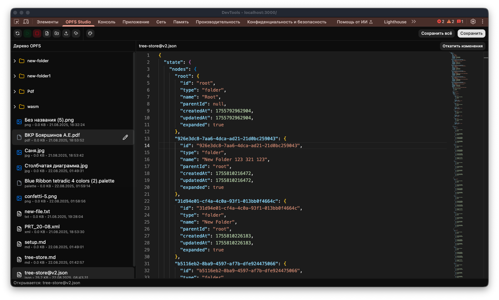
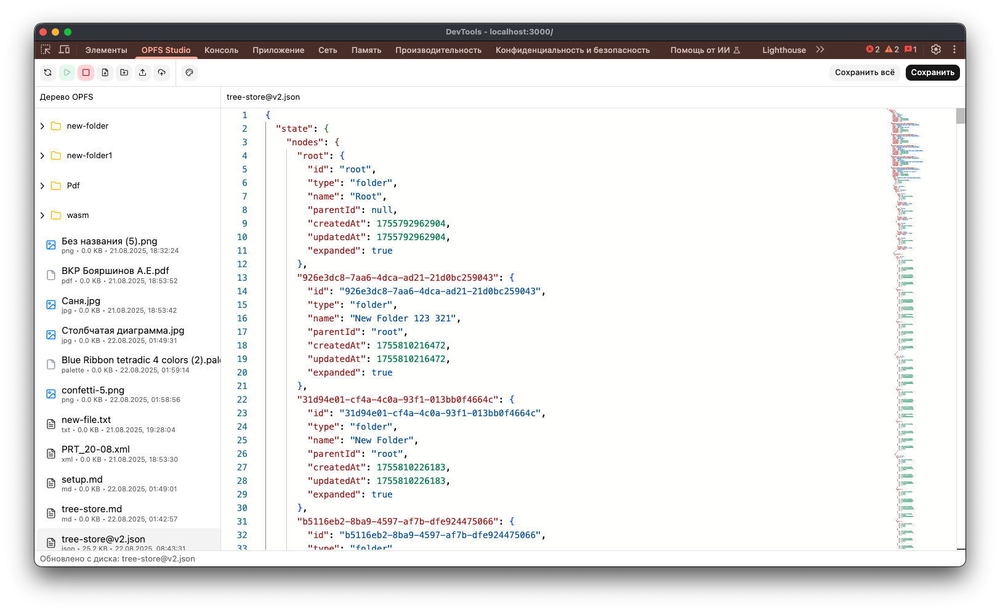
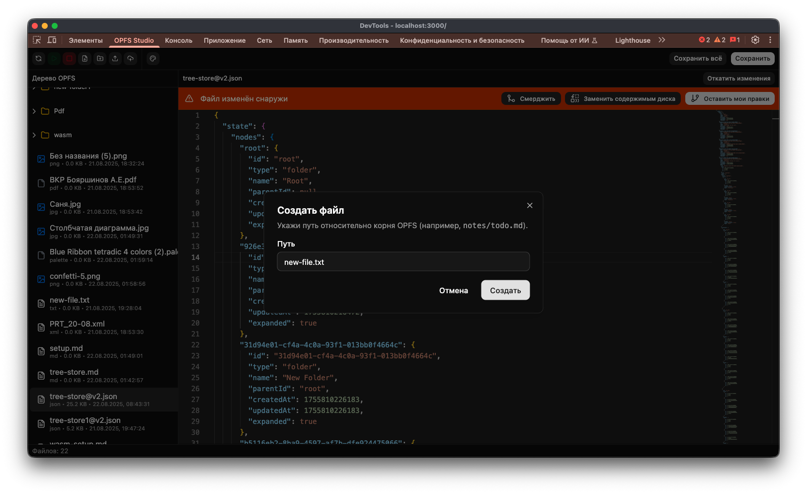
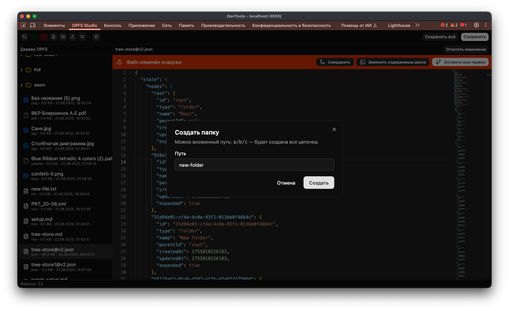
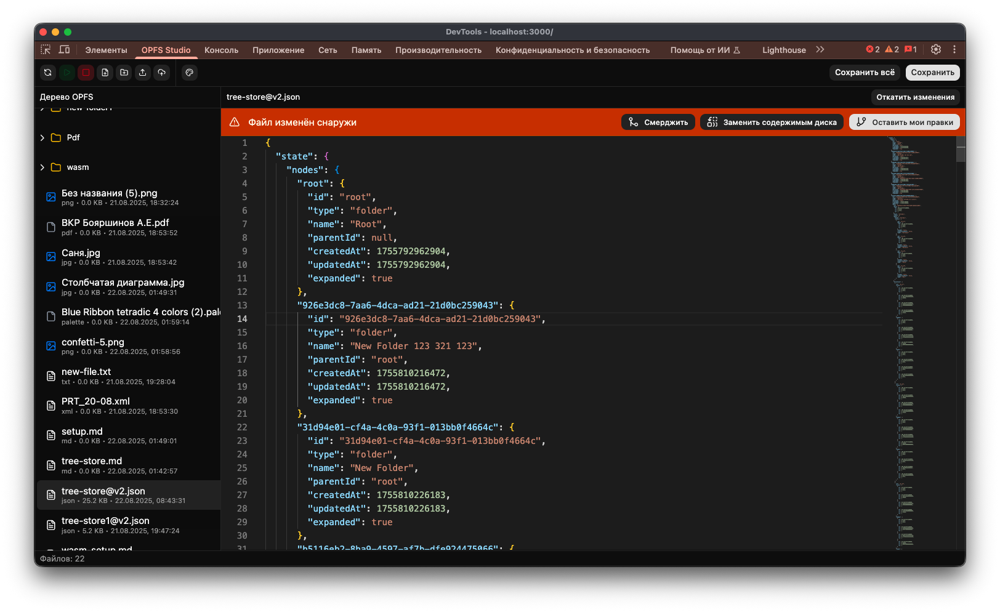
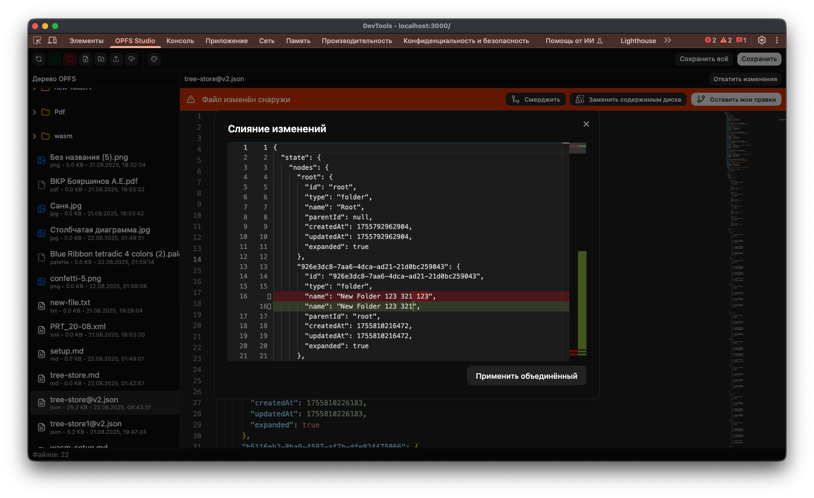

# OPFS Studio

**OPFS Studio** — это веб-приложение для работы с файловой системой браузера (Origin Private File System, OPFS).  
Оно позволяет просматривать, создавать, редактировать и синхронизировать файлы прямо в песочнице браузера.

---

## Основные возможности

- 📂 Файловое дерево с папками и файлами
- 📝 Встроенный редактор текста (Monaco Editor)
- 📑 Поддержка изображений, PDF и других форматов
- ➕ Создание/удаление файлов и папок
- ✏️ Переименование и перемещение
- 🔄 Обработка конфликтов при изменениях снаружи
- 🌗 Тёмная и светлая темы

---

## Скриншоты

Файловое дерево и редактор (тёмная тема):

Светлая тема:

Диалог создания файла:

Диалог создания папки:

Обработка конфликта:

Окно сравнения:

---

## Документация

- [Архитектура](./docs/architecture.md)
- [Функциональность](./docs/features.md)
- [Работа с конфликтами](./docs/conflicts.md)
- [Пользовательский интерфейс](./docs/ui.md)
- [Трудности и решения](./docs/troubleshooting.md)
