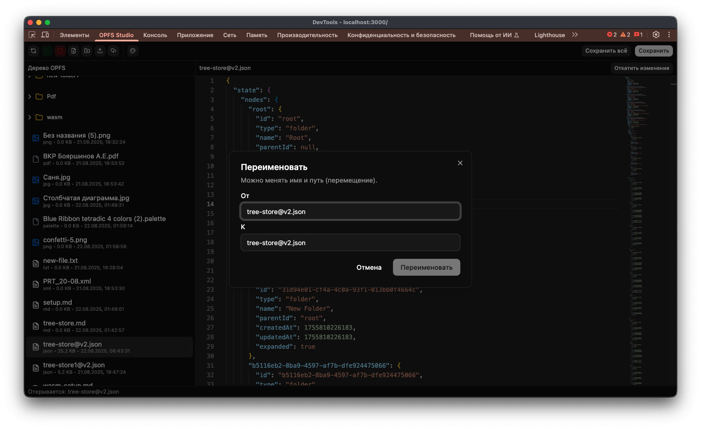

# Пользовательский интерфейс

## Темы

- Светлая и тёмная тема редактора.
- Переключение в настройках.

  

## Файловое дерево

- Отображение все файлы и папки.
- Иконки для разных типов (папка, файл, изображение, pdf).
- Контекстные действия: создать, удалить, переименовать.

## Редактор

- Подсветка синтаксиса для JSON, XML, Markdown.
- Отображение бинарных файлов (изображения, pdf) в режиме предпросмотра.
- Кнопки **Сохранить** и **Сохранить всё**.

## Диалоги

- Создание файла/папки (с указанием пути).
- Переименование (возможность менять имя и путь).
- Подтверждение удаления.

  
  

